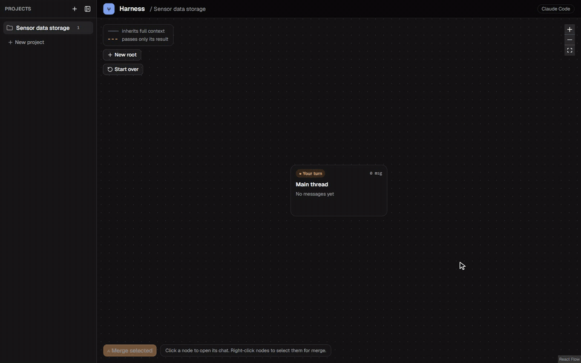

# Research Harness

**A research chat where the conversation is a graph, not a thread.**

*Built for my own workflow. Use it or don't, my graph won't mind.*

Ask a question, fork it into branches that each explore one direction, work them in parallel, then merge what they found back into one node and keep going. Every branch inherits the full context of where it started, and a merge receives a written result from each branch instead of their whole transcripts.



## Why this exists

Models can now write pages of confident text in seconds. Reading, checking and actually understanding those pages still takes a human, and one endless chat thread makes that harder with every reply.

Research Harness is my attempt to keep up. It breaks the work into small branches you can read, follow and question, keeps every result next to where it came from, and lets you choose what flows back. The model does the heavy lifting; you stay the one who knows what's going on.

A tool for thinking *with* an LLM, not for handing your thinking *to* one.

**A friendly note:** I built this around my own research workflow, so it's shaped by how I work. If it fits yours too, wonderful, and I'd love to hear about it. Ideas and feature requests are welcome, though I can't promise to get to all of them.

## Quick start

You need:

- **Node 24 or newer**
- **Claude Code**, installed and signed in once (run `claude` in a terminal and log in). Harness runs Claude through the official Claude Code CLI, so it uses your Claude subscription, or Amazon Bedrock, Google Vertex AI or Microsoft Foundry if you have Claude Code set up for them.
- **git**: each project folder is a git repository, so the model can edit files on its own branch.

Then run:
```bash
npx research-harness --app
```

The first `--app` start downloads Electron (about 100 MB); later starts are instant. Closing the window stops Harness.

| Option | What it does |
|---|---|
| `--app` | Open in a desktop window instead of a browser tab |
| `--no-open` | Start the server without opening anything |
| `--port <n>` | Use another port (default 47831) |

Update with `npx research-harness@latest`. Each version keeps its own copy of the database, so going back to an older version never loses work.

## How it works

1. **Start with a root node.** It is a normal chat.
2. **Fork** a node into branches. Each branch starts with everything its parent knew at that point.
3. **Work the branches**, one sub-question each. They run in parallel.
4. **Mark a branch Done** when you are through with it (a green marker, nothing more).
5. **Merge** any nodes into a new one. It gets the shared context once, plus a short report from each merged node (findings, sources, open questions, confidence), which the model writes when the merge starts.
6. **Continue** from the merged node, and fork again.

On the graph, a solid line means "inherits the full context" and a dashed line labelled *result* means "passes on only its result".

## Features

### The graph
- Nodes are cards showing their status (Working, Your turn, Done, Forked, Merging), title, last message, message count and unread replies.
- Click a card to open its chat full window; **← Graph** or Esc goes back to the same pan and zoom.
- Branches and merges keep running on the server while you look at something else, and the graph shows live progress ("Working · 1:42", "Searching the web: …").
- Titles are written by the model after the first reply. Rename any node with the pencil.
- A project can have several roots (**+ New root**) for independent threads that share the same folder.
- Deleting a node is a soft delete with **Undo**, and a **Deleted** list brings nodes back later.

### Forking
- Fork from the chat with **⑂ Fork**: write each branch's first message, add as many branches as you like, and give each its own files to read.
- **Fork from a reply:** click list items, table rows or sections in an answer to pick them, then fork one branch per pick with a shared instruction.
- **The model can propose branches** itself. You review and edit them, then start them with one click.
- Branches share the cached prompt prefix, so starting several at once is cheap.
- A forked node stays open: you can keep talking to it, and its branches keep only what it knew when they were forked.

### Merging
- Right-click any nodes on the graph to select them, then **Merge selected**. Branches, roots, finished or not, even nodes under different roots.
- The merge dialog shows the base the merge starts from, which results are reused or written now, file changes and conflicts, and the model to use.
- The merged node's chat shows exactly which results it received under *Inherited context*.
- The model can **ask an earlier node** (any ancestor of its node) a question, for example when a merge needs a detail a result left out. The answer comes from that node's full context without changing it. A few questions per message are free; after that it asks for your approval.

### Tools and files
- **Web search and web fetch** in every node, with the sources kept next to the reply.
- **Your project folder:** the model can read the files in the folder you choose for a project.
- **Attachments:** attach files or whole folders (or drop them on the chat). They are copied into the project, and later branches inherit what was read.
- **File editing:** each node works on its own git branch in its own copy of the project, so branches never overwrite each other. A changes panel shows the diff, and **Apply** merges a node's changes into the branch you have checked out. The model can also run shell commands (for example to build a LaTeX document) in its copy.

### Models
- Pick the model and effort per node, from the composer. Branches start with their parent's setting; the fork and merge dialogs let you choose others.
- Harness warns before a switch that would lose the prompt cache and cost more of your usage limit.
- A banner shows how much of your Claude usage limit is used, and **Retry** / **Retry all** pick up replies that hit the limit.

### Reading and writing
- Markdown, tables, code and math (`$…$` and `$$…$$`, rendered with KaTeX).
- Unread replies are marked, and a chat opens where you stopped reading.
- Unsent messages and their attachments are kept as drafts per node, also across restarts.

### Projects
- Several projects, each with its own graph and folder, in a sidebar sorted by recent use. Rename, archive or delete them.
- New projects can use an existing folder (it becomes a git repository if it is not one already) or get a new one.

## Settings

Settings are environment variables for now.

| Variable | Default | Meaning |
|---|---|---|
| `HARNESS_DATA_DIR` | per user, see below | Where the database and new project folders are kept |
| `HARNESS_MODEL` | `claude-sonnet-5-5` | Model for nodes without their own setting |
| `HARNESS_EFFORT` | `low` | Effort for nodes without their own setting |
| `HARNESS_MODELS` | | Extra model ids for the pickers, comma separated (for example Bedrock ids) |
| `HARNESS_ASK_LIMIT` | `3` | Questions to other nodes allowed per message before asking you (`0` always asks) |
| `HARNESS_CLAUDE_PATH` | found automatically | Path to the `claude` executable |
| `HARNESS_SERVER_PORT` | `47831` | Server port |

Claude Code's own variables (`CLAUDE_CODE_USE_BEDROCK=1`, `AWS_REGION`, and so on) are passed through, so Bedrock, Vertex AI and Foundry work the way they do in Claude Code.

**Your data** is kept in `%APPDATA%\research-harness` on Windows, `~/Library/Application Support/research-harness` on macOS and `~/.local/share/research-harness` on Linux. Harness listens on `127.0.0.1` only, and the database is backed up daily and before every upgrade.

To check that prompt caching works on your account (uses a little of your usage limit):

```bash
npx research-harness check-cache
```

## Development

Requires Node 24. From the repository root:

```bash
npm install
npm run dev
```

This starts the server on http://localhost:8787 and the web UI on http://localhost:5173.

| Command | What it does |
|---|---|
| `npm run dev` | Server and web UI with hot reload |
| `npm run desktop` | Build the web UI and open the Electron app |
| `npm run desktop:dist` | Build an installer for this OS in `apps/desktop/release/` |
| `npm test` | Server and web tests (Vitest) |
| `npm run typecheck` | TypeScript checks |
| `npm run lint` | Lint (oxlint) |

Set `HARNESS_PROVIDER=placeholder` to click through the app without calling a model.

npm 12 blocks install scripts, so two downloads have to be started by hand once: Electron's binary (`node node_modules/electron/install.js`) and, on Windows, Claude Code's executable (`node install.cjs` in the global `@anthropic-ai/claude-code` folder).

**Layout:** `apps/web` (React, React Flow, Tailwind, shadcn/ui), `apps/server` (Hono, `node:sqlite`, the Claude Code provider, the harness MCP server), `apps/desktop` (Electron), `apps/cli` (the `research-harness` npm package), `packages/shared` (types shared by web and server).
